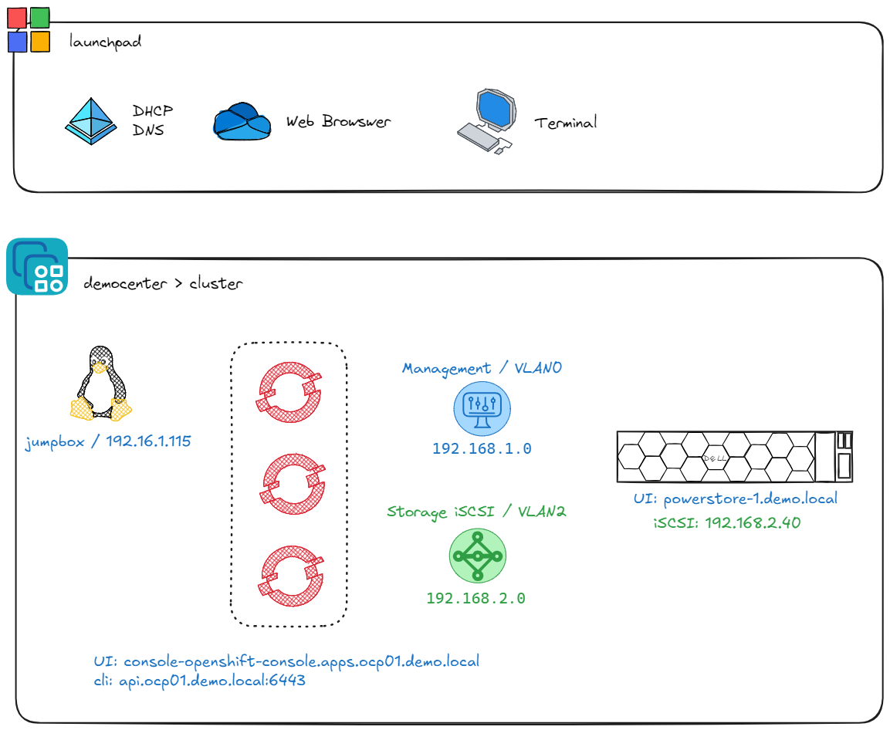

# csm-hol


## Goal
The Dell Technologies (Dell) [Container Storage Modules (CSM)](https://dell.github.io/csm-docs/docs/) enables simple and consistent integration and automation experiences, extending enterprise storage capabilities to Kubernetes for cloud-native stateful applications. 

The goal of this project is to enable an easy to consume tutorial and hands-on-lab **(aka: HOL-05xx-CSI-CSM-Dev)*- to allow end users to explore and understand the value that CSM adds to Kubernetes/OpenShift environments for persistent storage and data management.

This repository will include:
- Scripts and libraries to stand up CSI/CSM.
- Lab Guides on how to use the environment to learn about CSM.

## Supported Versions

This guide is currently supporting the following:
- OpenShift 4.17
- PowerStore 4.0
- CSM v1.13
  - CSI Driver (PowerStore 2.13.0)
  - CSM Resiliency 1.12
  - CSM Observability 1.6 (Helm only)

## Architecture
The Hands-on-Lab is available from [democenter.dell.com](https://democenter.dell.com/). It is composed of a _launchpad_ VM from which you will be able to access the lab & 3 beefy ESXi that hosts _PowerStore Virtual Appliance_ and a 3 nodes _OpenShift cluster_.



>NOTE: The credentials to access all the components are available in `creds.txt` on the Desktop of the _launchpad_.

## Usage

All the scripts and commands will be executed from the _jumpbox_, while the UI access will be through the _launchpad_.


### Configuration & Environment
The usual binaries such as `kubectl`, `oc` & `helm` are already installed on the _jumpbox_.

To set the environment variables:
```bash
source /home/prash/ocp/ocp01/env.sh
```

### Labs
At this step you are all set to begin with the [labs]().

## Unsupported
That HoL does not support:
- CSM Authorization
- CSM Replication
- CSM App Mobility
